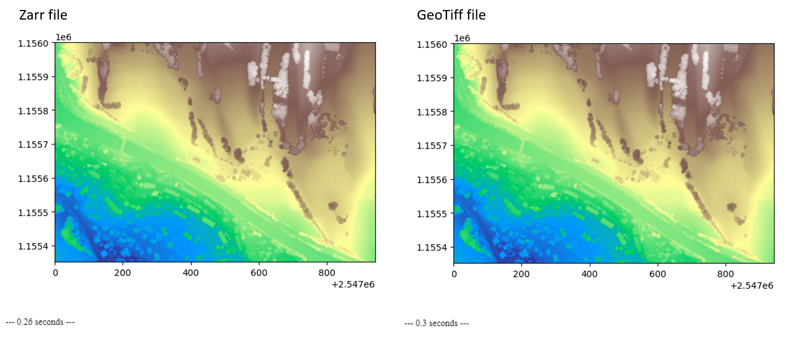

## Introduction

This code is just a couple of tests I did on a Zarr file compared to a Cloud Optimized GeoTIFF (COG).



The code in this repository performs the following tasks:

- Downloads a batch of digital surface models
- Creates a Zarr file from them
- Loads the Zarr file into a Jupyter notebook
- Repeats the process with GeoTIFF
- Compares the file types

**Conclusion**

- The zarr file is significantly smaller than the GeoTiff.
- The loading time is slightly better with the zarr file.

**Notes**

- the chunks has not been taken into account
- we do not use the capacity of zarr files to store multidimentional data
- we are not using the [geozarr](https://github.com/zarr-developers/geozarr-spec) functionalities (under development)

## Installation

1. Clone this repository.
2. Install the necessary dependencies.
3. Run the Jupyter notebook.

### Dependencies:

All external packages are defined into the `pyproject.toml`.

### Project dependencies installation

To install the project dependencies, run `pip` as follows:

```bash
pip install .
```

The `pyproject.toml` contains the `[project.optional-dependencies]` selection to define the development dependencies:

To install these dependencies, run:

```bash
pip install .[dev]
```

### Jupyter Notebook

To run the notebook, go to notebook folder of your project and run :

```bash
python -m notebook
```
